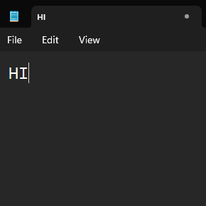

# CH340 Keyboard emulator for Windows

This program is a keyboard emulator for Windows that uses the CH340 USB-to-serial converter. It allows you to send keystrokes to your computer by connecting a CH340 device and sending data to it.

## Notes

* Works at 230400 baud
* The program translates the serial data into keystrokes and sends them to the operating system following the [Microsoft's VK key codes](https://learn.microsoft.com/en-us/windows/win32/inputdev/virtual-key-codes).

## Example Usage

```c
void setup() {
    Serial.begin(230400);
}

int hKey = 0x48; // H
int iKey = 0x49; // I

void loop() {
    Serial.write(hKey);
    Serial.write(iKey);

    // OUTPUT: "HI"

    while(true) {
        // Do nothing
    }
}
```


